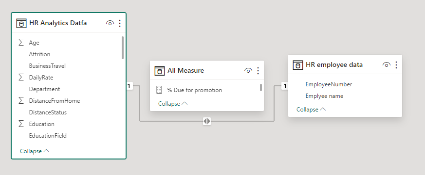

# HR Dashboard Project Overview

## Introduction
The HR Dashboard project is designed to provide a comprehensive view of various HR-related metrics within the organization. Leveraging Power BI, this dashboard offers insights into employee data, including total employees, retrenchment statistics, promotions by department, and overtime trends. The dashboard comprises three main pages: Home, Action, and Detail, each focusing on specific HR-related data sets.

## Purpose
The primary purpose of this HR Dashboard is to empower HR personnel and organizational decision-makers with actionable insights derived from HR data. By visualizing crucial metrics in a user-friendly format, it aims to facilitate informed decision-making, streamline HR processes, and enhance workforce management strategies.

## Insights
### Pages
The Home Page, Action Page, and Detail Page serve as an overview dashboard, presenting key HR metrics at a glance. It includes:

- **Total Employees:** Provides a snapshot of the current workforce strength.
- **Retrenchment Statistics:** Displays trends and insights related to employee terminations or layoffs.
- **Promotions by Department:** Visualizes promotions across different departments within the organization.
- **Overtime Trends:** Highlights patterns of overtime hours worked by employees.

## Results
The HR Dashboard has resulted in several positive outcomes:

- **Improved Decision-making:** Stakeholders can make data-driven HR decisions promptly.
- **Enhanced Efficiency:** Streamlined HR processes leading to improved workforce management.
- **Better Resource Allocation:** Insights into overtime trends aid in optimizing resource allocation.
- **Focused Interventions:** Targeted strategies for departments needing improvement or attention.

In conclusion, the HR Dashboard on Power BI offers a comprehensive view of critical HR metrics, fostering informed decision-making and enabling proactive management of the organization's workforce.
